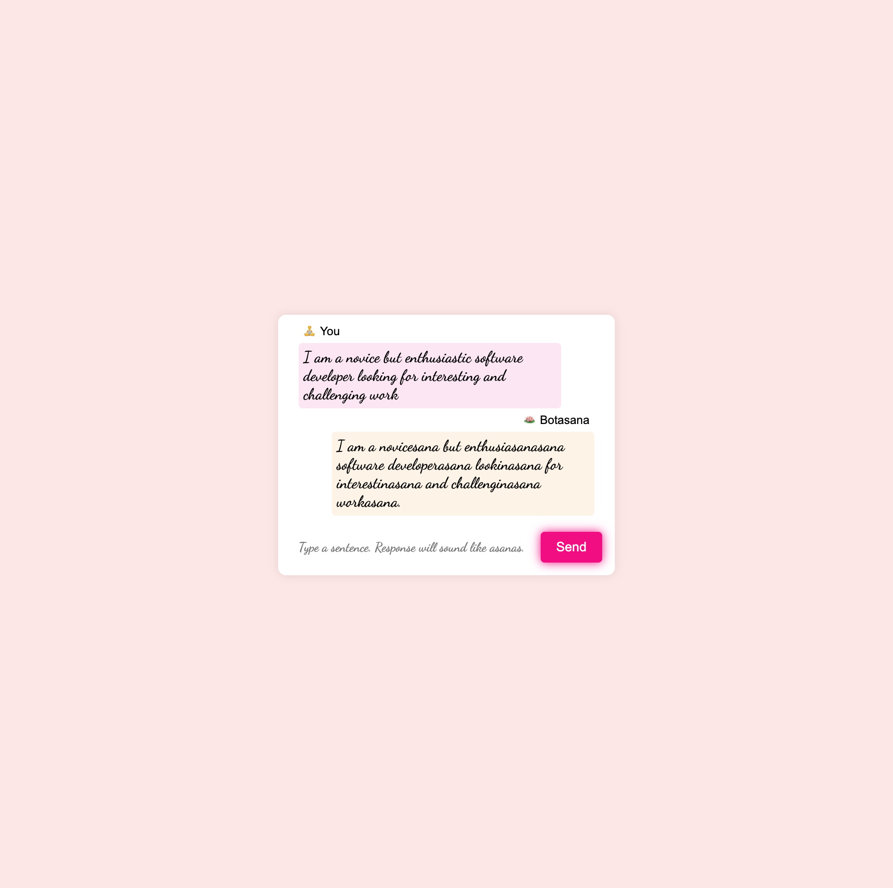

# Botasana chatbot

## Introduction

I have successfully finished a bootcamp recently. And I am applying for jobs now. 
I am working on this project in order to practice, extend, and, hopefully, showcase my software development skills.

Originally, I set the goal much higher and this is just the first step towards it.
I continue to work on the project in between interviews and preparation.
Stay tuned for further developments and spin-offs.

## Description

_Botasana_ is a chatbot that replies with humorously edited user prompt. Some words in the user prompt are modified in order to resemble names of yoga [asanas](https://en.wikipedia.org/wiki/Asana).

To achieve this _Botasana_ uses a [OpenAI comletion API](https://platform.openai.com/docs/guides/text-generation).

## Try it!

### Using Docker image

> [!Note]
> You will need your own [OpenAI API key](https://platform.openai.com/docs/quickstart/account-setup) to run it locally. Otherwise check my [homepage](ka1amita.github.io) if there is currently a live version running.

1. Download the image from Docker Hub and run it locally.
   ```shell
   docker run -dp 127.0.0.1:8080:8080 -e SECRET_OPENAI_API_KEY=<your-openai-api-key> ka1amita/botasana
   ```
1. Open [127.0.0.1:8080](http://127.0.0.1:8080) in your browser.
1. Send your prompt.

> [!TIP]
> add `-e PROMPT_VALIDATION_LENGTH_MAX=<desired-limit>` to increase prompt limit

## Sample

##### 1. Landing page


##### 2. User prompt


##### 3. Fetching response


##### 4. Chat completion



##### Error message


## Tech stack

Todo list of technologies planned to implement:
+ [x] OpenAI API 
+ [x] Spring Boot 
+ [ ] PostgreSQL
+ [x] Java
+ [x] Log4j
+ [x] Jupiter
+ [x] Docker
+ [X] HMTL, CSS, JS
+ [X] Thymeleaf
+ [ ] HTMX
+ [ ] Terraform
+ [ ] AWS
+ [ ] GitHub Acitons
+ [ ] ELK
